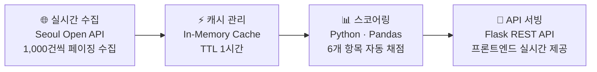

<div align="center">

# 📊 JobLens

### 서울시 공공 채용공고 정보품질 진단 & 노동시장 분석 플랫폼

채용 공고를 볼 때마다 드는 의문 — **"이 공고, 믿고 지원해도 되나?"**
서울시 실시간 채용공고 20,000건+을 데이터로 진단해 답합니다.

[](https://www.python.org/)
[](https://flask.palletsprojects.com/)
[](https://pandas.pydata.org/)
[](https://render.com/)
[](#license)

[🔗 Live Demo](https://joblens-test.onrender.com) · [📁 Repository](https://github.com/thienngminh0406-byte/Joblens)

</div>

---

## 📌 목차

- [개요](#-개요)
- [스크린샷](#-스크린샷)
- [핵심 기능](#-핵심-기능)
- [JobLens Score — 채점 기준](#-joblens-score--채점-기준)
- [데이터 파이프라인](#-데이터-파이프라인)
- [기술 스택](#-기술-스택)
- [프로젝트 구조](#-프로젝트-구조)
- [로컬 설치 및 실행](#-로컬-설치-및-실행)
- [API 엔드포인트](#-api-엔드포인트)
- [배운 점](#-배운-점)
- [License](#license)

---

## 🧭 개요

**JobLens**는 서울시 공공데이터포털의 실시간 채용공고 API를 수집원으로, **직무상세성 · 기업소개 · 급여품질 · 복지 · 근무조건 · 출퇴근편의** 6개 지표로 공고의 정보 충실도를 자동 채점하고, 노동시장 전체의 패턴을 분석하는 1인 개발 플랫폼입니다.

전체 공고를 채점한 결과 **약 77%가 C·D등급(정보 부족)**으로 나타나는 등, 채용 시장의 구조적 문제를 데이터로 드러냈습니다. AI 협업 도구(Claude)를 개발 파트너로 활용해 기획 의도를 코드로 구현했고, 데이터 소싱 · 검증 · 의사결정은 직접 주도했습니다.

| 20,000+ | 6개 | 2개 | 1시간 |
|:---:|:---:|:---:|:---:|
| 실시간 분석 대상 공고 | 자동 진단 지표 | 연동 공공데이터 | 자동 갱신 주기 |

---

## 🖼 스크린샷

> 아래 이미지는 준비 중입니다. `docs/screenshots/` 폴더에 캡처 파일을 추가한 뒤 파일명만 맞춰주면 자동으로 표시됩니다.

| Dashboard | Market Analysis |
|---|---|
|  |  |

| Posting Diagnosis | AI Diagnosis |
|---|---|
|  |  |

| Job Search | Top100 |
|---|---|
|  |  |

---

## ✨ 핵심 기능

- **📈 Dashboard** — 전체 활성 공고 수, 평균 점수, 등급 분포, 등록 추이를 한눈에
- **📊 Market Analysis** — 직무 분포, 경력 조건, TOP10 vs 시장 평균 비교, 급여 vs 점수 산점도, 항목 간 상관관계 분석
- **🔍 Job Search** — 키워드 · 등급 · 경력 · 직무별 필터링과 정렬이 가능한 실시간 공고 탐색
- **📝 Posting Diagnosis** — 작성 중인 채용공고를 입력하면 실시간 시장 데이터 대비 예상 점수 · 등급 · 순위 · 개선 포인트를 즉시 진단
- **🧠 AI Diagnosis** — 실제 등록된 공고를 선택해 시장 평균과 비교하고 강점 · 약점을 자동 분석
- **🏆 Top100** — JobLens Score 상위 100개 공고와 우수 공고 공통 특징 제시
- **ℹ️ About** — 채점 기준, 데이터 파이프라인, 등급 체계에 대한 투명한 설명

---

## 🧮 JobLens Score — 채점 기준

6개 항목의 키워드 분석과 정보 충실도를 기반으로 점수를 자동 산출합니다.

| 항목 | 배점 | 평가 내용 |
|---|:---:|---|
| 📋 직무상세성 | 30점 | 담당 업무, 필요 역량, 사용 도구, 협업 방식, 성과 기준의 구체성 |
| 🏢 기업소개 | 20점 | 회사 규모, 주요 사업, 조직 문화, 성장 비전의 충실도 |
| 💰 급여품질 | 20점 | 급여 정보의 구체성과 투명성 (금액 명시 여부) |
| 🎁 복지 | 15점 | 4대보험 외 식대 · 교통비 · 연차 · 교육비 등 실질 혜택의 다양성 |
| 🕐 근무조건 | 20점 | 근무지 · 근무시간 · 휴일 · 주 근무시간 정보의 완성도 |
| 🚇 출퇴근편의 | 10점 | 인근 지하철역 · 버스 정류장 · 도보 거리 등 접근성 정보 |

**등급 기준**

| 등급 | 기준 | 의미 |
|:---:|:---:|---|
| S | 90점+ | 시장 최상위 |
| A | 80점+ | 정보 매우 충실 |
| B | 70점+ | 주요 정보 제공 |
| C | 55점+ | 일부 보완 필요 |
| D | ~55점 | 핵심 정보 부족 |

---

## 🔄 데이터 파이프라인



1. **실시간 수집** — 서울시 `GetJobInfo` API에서 1,000건씩 페이징하여 전체 공고 수집, 마감 공고 자동 필터링
2. **캐시 관리** — 수집 데이터를 서버 메모리에 캐싱, TTL 1시간이 지나면 백그라운드에서 자동 갱신
3. **스코어링** — 6개 항목 키워드 분석 및 조건 평가로 JobLens Score 자동 산출, S~D 등급 부여
4. **API 서빙** — `/api/stats`, `/api/jobs` 등 REST 엔드포인트로 프론트엔드에 실시간 데이터 제공

추가로 **국민연금공단 사업장정보 API**를 연동해 회사명 정규화 매칭 로직으로 급여 정보를 교차 검증합니다.

---

## 🛠 기술 스택

| 영역 | 사용 기술 |
|---|---|
| Backend | Python 3.11, Flask, Gunicorn |
| Data | Pandas, Seoul Open API, 국민연금공단 API |
| Frontend | Vanilla JS, SVG Charts, Pretendard Font |
| Infra / CI | Render 배포, GitHub Actions (데이터 자동 갱신) |
| 협업 도구 | Claude (AI 개발 파트너) |

---

## 📁 프로젝트 구조

> 실제 리포지토리 구조와 다르면 알려주시면 맞춰서 수정해 드릴게요. 아래는 일반적인 Flask 프로젝트 구성 예시입니다.

```
Joblens/
├── app.py                  # Flask 앱 진입점, 라우팅 및 API 엔드포인트
├── scoring.py               # 6개 지표 채점 로직 (JobLens Score)
├── data_pipeline.py          # 서울시 API 수집 · 국민연금 매칭 · 캐싱
├── requirements.txt
├── static/
│   ├── css/
│   └── js/
├── templates/
│   └── index.html
├── docs/
│   └── screenshots/          # README용 캡처 이미지
├── .github/
│   └── workflows/
│       └── refresh-data.yml   # 데이터 자동 갱신 (GitHub Actions)
└── README.md
```

---

## 💻 로컬 설치 및 실행

### 1. 클론 및 가상환경 설정

```bash
git clone https://github.com/thienngminh0406-byte/Joblens.git
cd Joblens

python -m venv venv
source venv/bin/activate   # Windows: venv\Scripts\activate
```

### 2. 의존성 설치

```bash
pip install -r requirements.txt
```

### 3. 환경변수 설정

프로젝트 루트에 `.env` 파일을 만들고 아래 값을 채워주세요.

```env
SEOUL_API_KEY=발급받은_서울시_열린데이터광장_인증키
NPS_API_KEY=발급받은_국민연금공단_인증키
FLASK_ENV=development
```

- 서울시 열린데이터광장: https://data.seoul.go.kr 에서 `GetJobInfo` API 신청
- 국민연금공단 사업장정보: https://www.data.go.kr 에서 신청

### 4. 로컬 서버 실행

```bash
python app.py
# 또는 배포 환경과 동일하게
gunicorn app:app
```

기본적으로 `http://localhost:5000` 에서 확인할 수 있습니다.

### 5. 데이터 강제 새로고침 (선택)

```bash
curl -X POST http://localhost:5000/api/refresh
```

---

## 🔌 API 엔드포인트

| Method | Endpoint | 설명 |
|---|---|---|
| GET | `/api/stats?period=` | 전체 통계 (평균 점수, 등급 분포, 추이, 히스토그램 등) |
| GET | `/api/status` | 데이터 수집 상태 확인 |
| GET | `/api/jobs?keyword=&grade=&career=&job=&sort=&page=` | 필터 · 정렬 · 페이지네이션 지원 공고 검색 |
| GET | `/api/jobs/recent?n=` | 최근 등록 공고 N건 |
| GET | `/api/jobs/top?n=` | JobLens Score 상위 N건 |
| GET | `/api/filters` | 검색 필터용 직무 · 경력 목록 |
| GET | `/api/top100/stats` | Top100 공고 통계 (직무 · 기업 분포) |
| POST | `/api/refresh` | 데이터 강제 재수집 트리거 |

---

## 💡 배운 점

> 데이터 프로젝트에서 가장 중요한 건 화려한 알고리즘이 아니라, **"이 데이터로 무엇을 정직하게 말할 수 있는가"**를 판단하는 능력이라는 걸 배웠습니다.
>
> 데이터가 부족하면 스코프를 줄이고, 매칭이 불확실하면 보여주지 않고, 한계가 있으면 있는 그대로 안내하는 것 — 이 반복된 선택들이 결국 신뢰할 수 있는 제품을 만든다는 걸 이번 프로젝트를 통해 체감했습니다.

당초 계절성 분해(STL)와 연 단위 채용 수요 변곡점 탐지를 구현하려 했으나, 서울시 공공데이터가 마감 공고를 즉시 삭제해 실제 보유 기간이 30~90일에 불과하다는 제약을 발견했습니다. 무리하게 '연간 트렌드'를 주장하는 대신, **"요일별 등록 패턴 + 최근 변화 시점 감지"**로 분석 스코프를 스스로 조정하고, 매일 자동으로 키워드 빈도를 누적 수집하는 구조를 새로 설계해 장기 트렌드 데이터를 지금부터 직접 쌓아가고 있습니다.

---

## License

이 프로젝트는 [MIT License](LICENSE)를 따릅니다.

---

<div align="center">

**Nguyen Minh Thien** · [GitHub](https://github.com/thienngminh0406-byte) · thienngminh0406@gmail.com

</div>
